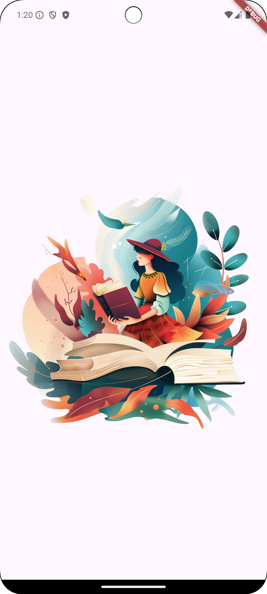
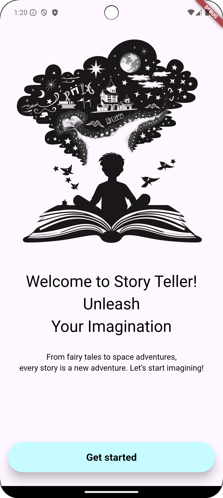
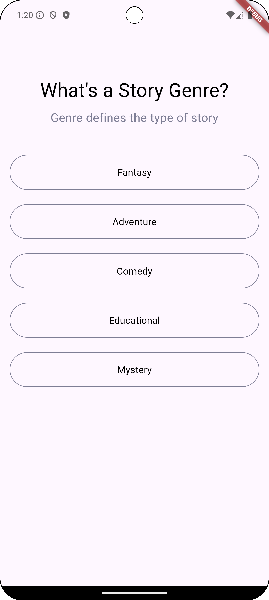
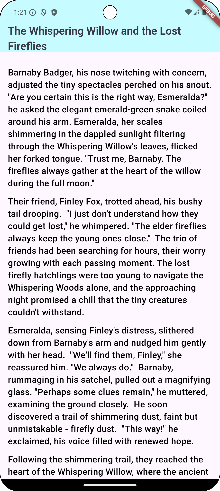

#### Story Teller App

#### Overview

Story Teller is an AI-powered application that allows users to generate unique stories based on their chosen
specifications. As parents, it can be challenging to tell a story every time your child asks, so this app captures data
from the user and provides an appropriate story based on their inputs.

#### Features

- **Customizable Story Specifications**: Choose from multiple genres, character types, settings, and themes.
- **AI-Generated Stories**: Uses advanced generative AI, including Google Generative AI APIs and Gemini APIs, to create
  unique and engaging stories.
- **User-Friendly Interface**: Simple design for seamless storytelling.

#### Planning

- Implement an app that captures user input to generate stories tailored to needs.
- Ensure the application uses AI to craft engaging, age-appropriate narratives.
- Provide an intuitive interface for parents and children to interact with stories easily.

#### Design

- Implement pages to capture story data from the user.
- Develop a home page where users can read generated stories.
- Integrate Google Generative AI APIs, such as Gemini APIs, for story generation, similar to using a custom API.

#### How It Works

1. **Select Story Specifications**: Choose from predefined options or enter custom preferences for genre, characters,
   and theme.
2. **Generate Story**: The AI processes your inputs and creates a unique story.
3. **Read & Enjoy**: Read your generated story and make edits if needed.

#### TODO FEATURES

* Offline mode support.

#### Screenshots

##### Splash Page



##### Onboarding Page



##### Select Story's genre Page



##### Home Pge



#### Installation & Setup

#### Prerequisites

GEMINI_API_KEY, Go to Google AI Studio, and create one, if you don't have one.


##### Requirements

- Flutter (latest stable version)
- Dart SDK
- GEMINI API KEY


##### Steps

1. Clone the repository:
   ```sh
   git clone https://github.com/maher-linkdev/story_teller_app.git
   cd story_teller_app
   ```
2. Install dependencies:
   ```sh
   flutter pub get
   ```
3. Run the app:
   ```sh
   flutter run --dart-define=GEMINI_API_KEY="REPLACE_THIS_TEXT_WITH_YOUR_GEMINI_API_KEY"
   ```

#### License

This project is licensed under the MIT License.

#### Contact

For any inquiries, suggestions, or contributions, please contact [maherelamary.linkdev@gmail.com].

